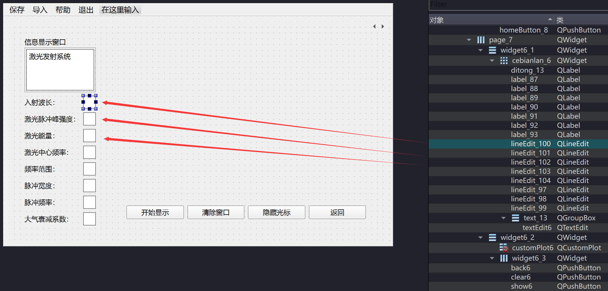

# 1. 使用说明

## 1.1. 常用修改说明

### 1.1.1. 增加展示界面按键数量

 **1. 修改show1buttongroupmanager**
  - **头文件**
    - 修改`Show1ButtonGroup`类成员变量和构造函数
    - 增加`Show1ButtonGroupId`枚举类型
  - **源文件**
    - 在构造实现中通过`addEvent`函数注册新增按键事件
  
 **2. 修改plotView**
 - **源文件**
   - 构造函数中挂载新增按键
   - `handleShow1ButtonGroupManagerEvent`函数中将事件暴露出

### 1.1.2. 增加绘制曲线页面数量

 **1. 修改UI文件**
 - 注意组件命名：三个widget和（在css文件中使用）；cebianlan命名（在css文件和plotView文件中使用）;customplot、back、show、clear、tracer、textEdit按照顺序依次排下来
 - 所有lineEdit新建时，需要保证界面顺序和组件顺序一致，**否则影响变量传入顺序**：

 **2. 修改buttongroupmanager文件**
 - **头文件**
    - 修改`Show1ButtonGroup`类成员变量和构造函数
    - 增加`Show1ButtonGroupId`枚举类型

 **3. 修改plotView文件**
  - **头文件**
    - 修改`QList<int> plotPageIndex`，增加界面索引
  - **源文件**
    - 挂载所有新增组件
    - 修改`getCurrentPageCustomPlot`函数
    - 修改`updateViewStyleSlot`函数
    - 修改`updateViewCurveSlot`函数
    - 修改`handleButtonGroupManagerEvent`函数

 **4. 修改lineeditgroupmanager文件**
  - **源文件**
    - 修改`LineEditGroup`函数，改变页面与变量页的映射
  
 **5. 修改pagedatagenerator文件**
 - **源文件**
   - 修改`generatePairOfData`函数
   - 修改`storeRuntimeDataByIndex`函数

 **6. 修改constantmap文件**
- **源文件**
  - 增加新增页面需要的常量组
  - 在构造中插入新增页面的常量组，并且确定常量组索引，然后可以到前面`lineeditgroupmanager`文件中修改`LineEditGroup`函数，改变页面与常量组的映射

 **7. 修改constantstorage文件**
- **源文件**
  - 增加构造中新增页面的常量组的初始值存储
  - 修改`savePageRuntimeDataToCSVFile`函数
  - 修改`saveAllPageRuntimeDataToCSVFile`函数的循环次数

